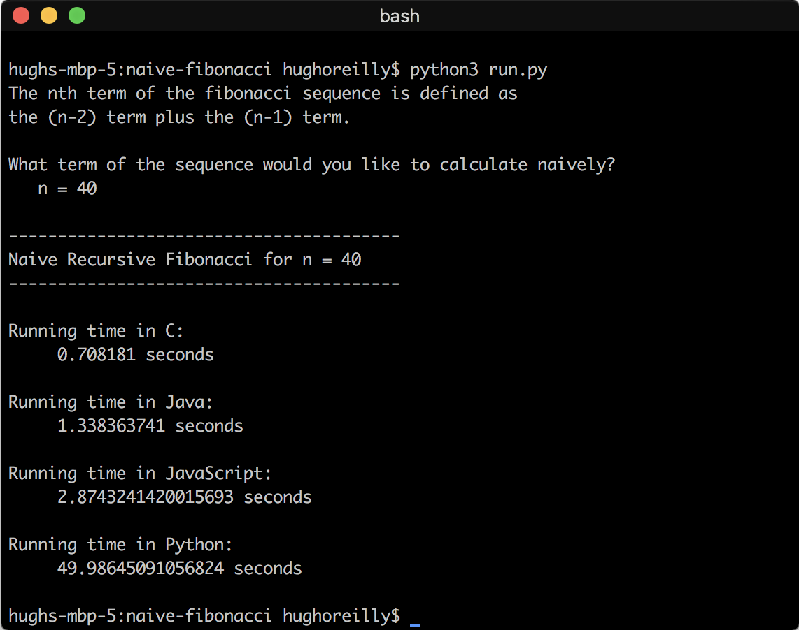

# naive-fibonacci
Compares the runtime of a naive recursive implementation of the fibonacci sequence in Python, C, and Java. I was curious.

## How to run on mac OS
- Make sure your computer can run Python3, Java8, and C programs
- Clone the repo
- Navigate to the proper directory
- Run `python3 run.py` in the terminal
- Enjoy!
